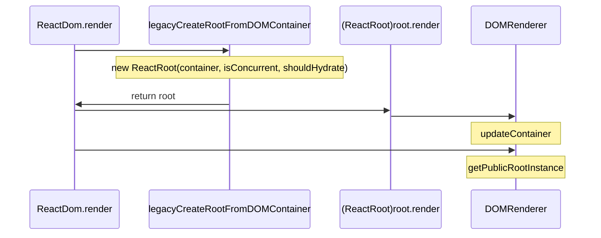
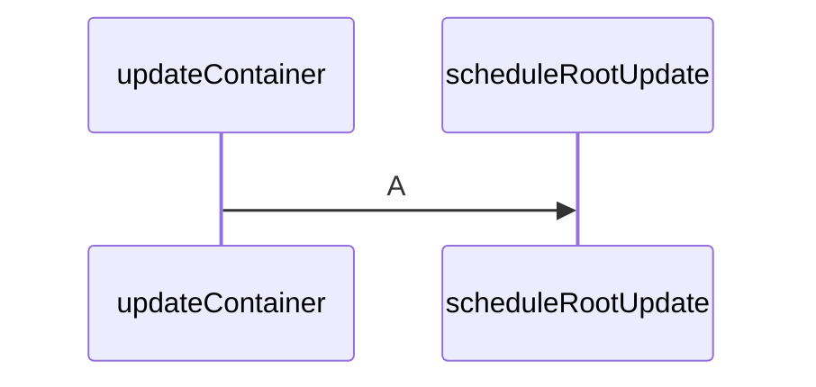

```javascript
updateContainer
export function DOMRender.getPublicRootInstance = function(
  container: OpaqueRoot,
): React$Component<any, any> | PublicInstance | null {
  const containerFiber = container.current;
  if (!containerFiber.child) {
    return null;
  }
  switch (containerFiber.child.tag) {
    case HostComponent:
      return getPublicInstance(containerFiber.child.stateNode);
    default:
      return containerFiber.child.stateNode;
  }
}
```

    alt 普通商户
      B->>C: generateTradeAppPayReqArgs
      activate C
      NOTE right of C: 微信侧下单
      C->>A: 返回客户端请求参数
      deactivate C
    else 特约商户
      B->>C: generateProviderAppPayReqArgs
      activate C
      NOTE right of C: 微信侧下单
      C->>A: 返回客户端请求参数
      deactivate C
    end